# Lean Six Sigma Process Improvement

## Overview
This project applies the Lean Six Sigma principles in order to improve the efficiency, as well as consistency, of a homemade crispy potato cooking process. Over numerous cooking experiemnts, different times of each step were recorded, bottlenecks were identified, and numerous workflow changes were tested in order to prevent any time being wasted, yet still maintaining product quality. [Crispy Potato Process Improvement Study](https://drive.google.com/drive/folders/11wcdyJ_9n11BDbFKttX3Tapga-7NwzLa)

## DMAIC
### Define
The original cooking process was inconsistent. Numerous problems included excessive frying time, larger batches requiring significantly more time, limited equipment capacity, and an inconsistent workflow between cooking sessions. Earlier attempts also produced potatoes that were often soggy, overly oily, and lacked consistent crispiness, demonstrating the need for a more standardized process.

### Measure
A time study was conducted across twelve cooking experiments. Each trial recorded the duration of every major process step to establish a baseline, compare process variation, and identify where the greatest amount of time was being spent.

Steps:
- Peeling
- Cutting
- Soaking in Salt Water
- Drying
- Vinegar-Water Boiling
- Final Drying
- Frying

### Analyze

When comparring all twelve cooking logs, there were numerous recurring problems.

The frying stage took the longest time, becoming the primary bottleneck. Having larger potato batches didn't help either, mainly because of the oil temperature recovering slower. It didn't help with the equipment limitations involved, mainly because of the fact I used smaller cooking pots, which hampered the process efficiency.

Additional observations also showed that organizing preparation steps and maintaining a consistent workflow helped reduce unnecessary waiting between stages.

### Improve

Several process improvements were tested throughout the twelve cooking experiments.

These improvements included:

- Limiting potato batches to improve frying efficiency.
- Preheating the cooking oil before frying.
- Using a larger cooking pot to prevent overcrowding.
- Standardizing drying procedures before frying.
- Experimenting with vinegar-water cooking times.
- Refining preparation workflow to reduce idle time between process steps.

Each experiment built upon observations from previous trials to gradually improve process consistency.

### Control

The final process recommendations help maintain consistent product quality while reducing unnecessary cooking time.

Recommended standard practices include:

- Limit each batch to two or three potatoes.
- Always preheat the oil before frying.
- Use a sufficiently large cooking pot.
- Maintain consistent drying times before frying.
- Follow the standardized cooking workflow developed throughout the study.

These recommendations reduce process variation while improving consistency and minimizing wasted energy.

## Key Results

- 12 documented cooking experiments
- Complete time study of every major process step
- Identified frying as the primary process bottleneck
- Developed standardized cooking workflow
- Reduced unnecessary energy usage by recommending smaller batch sizes
- Applied Lean Six Sigma DMAIC methodology to a real-world process

### Process Data Summary

A total of twelve cooking experiments were conducted to evaluate how process changes affected preparation time, cooking efficiency, and overall workflow. Each experiment recorded the duration of every major process step, allowing bottlenecks and process improvements to be identified over time.

#### Overall Time Study

| Log | Potatoes | Frying Time | Total Time | Key Observation |
|------|---------:|------------:|-----------:|-----------------|
| #1 | 2 | 20:00 | 42:29 | Baseline process established |
| #2 | 3 | 33:33 | 1:00:50 | Oil not fully preheated |
| #3 | 4 | 48:00 | 1:31:50 | Equipment limitations appeared |
| #4 | 4 | 45:00 | 1:17:29 | Lemon-water experiment |
| #5 | 4 | 22:00 | 50:19 | Most efficient overall process |
| #6 | 5 | 1:28:00 | 2:20:14 | Largest bottleneck observed |
| #7 | 4 | 57:34 | 1:33:51 | Preparation improved, frying remained bottleneck |
| #8 | 4 | 40:07 | 1:18:03 | Fastest preparation stages |
| #9 | 7 | 43:20 | 1:25:41 | Old knife proved more efficient |
| #10 | 5 | 1:19:34 | 2:25:24 | Parallel workflow introduced |
| #11 | 4 | 55:00 | 1:38:34 | Process flaws, successful outcome |
| #12 | 6 | 1:09:10 | 1:59:57 | Smaller batches recommended |

**Note:** In Log #10, the recorded total time includes overlapping vinegar-water boiling and post-boil drying activities. The actual elapsed ("wall-clock") time was somewhat shorter because these two tasks were performed in parallel.

#### Major Process Findings

| Observation | Finding |
|-------------|---------|
| Primary Bottleneck | Frying consistently consumed the largest portion of total process time. |
| Batch Size | Larger batches increased total cooking time disproportionately. |
| Equipment | Small pot size reduced boiling and frying efficiency. |
| Knife Selection | The original knife provided faster, more consistent cutting than the newer knife. |
| Workflow | Overlapping boiling and drying reduced idle time. |
| Standardized Process | Repeating the same workflow improved consistency across later experiments. |

Overall, the collected data demonstrated that improvements to preparation stages reduced manual work, but system throughput remained constrained by the frying operation. Future process improvements should prioritize heat management, equipment capacity, and batch sizing to further reduce total cycle time.

#### Bottleneck Analysis

Throughout the twelve cooking experiments, several recurring bottlenecks were identified. While preparation times generally improved through practice and workflow refinement, the frying stage consistently limited the overall throughput of the process.

| Process Step | Observation | Improvement Opportunity |
|--------------|-------------|-------------------------|
| Frying | Longest stage in every experiment and primary system bottleneck. | Improve oil temperature control, reduce batch size, or use larger equipment. |
| Vinegar-Water Boiling | Larger batches required multiple boiling cycles due to limited pot capacity. | Use a larger pot or reduce the number of potatoes per batch. |
| Cutting | Early experiments showed high variation due to knife choice and technique. | Standardize cutting method and continue using the original knife. |
| Drying | Longer drying improved crispiness but increased preparation time. | Determine the minimum effective drying time. |
| Workflow Organization | Early logs contained idle time between stages. Later experiments introduced overlapping tasks to improve efficiency. | Continue using parallel preparation where practical. |

### MOST Analysis

The crispy potato process was evaluated from a work measurement perspective using MOST (Maynard Operation Sequence Technique).

Although a complete MOST time standard was not developed for this project, several manual tasks were identified as candidates for future analysis, including:

- Peeling potatoes
- Cutting potatoes into uniform strips
- Moving potatoes between soaking, drying, and boiling stages
- Loading and unloading potatoes from the frying pot
- Organizing tools and workspace during preparation

A future MOST analysis could establish standard times for each manual operation, identify unnecessary motions, and further reduce overall process time through improved work methods.

## Process Maps

The cooking process was organized into three major phases: **Preparation**, **Cooking**, and **Continuous Improvement**. Separating the workflow into phases made the process easier to analyze and helped identify where delays occurred.

```mermaid
flowchart LR

    A([Start])

    subgraph P[Preparation]
        B[Gather Ingredients] --> C[Peel Potatoes] --> D[Cut Potatoes] --> E[Soak in Salt Water] --> F[Dry Potatoes]
    end

    subgraph CKG[Cooking]
        G[Boil in Vinegar Water] --> H[Final Drying] --> I[Preheat Canola Oil] --> J[Fry Potatoes]
    end

    subgraph CI[Continuous Improvement]
        K[Taste & Evaluate Quality] --> L[Record Times & Observations] --> M[Compare with Previous Logs] --> N[Adjust Process for Next Trial]
    end

    A --> B
    F --> G
    J --> K
    N --> O([End])
```

## Data Analysis

This section presents quantitative analyses performed using data collected throughout the crispy potato process improvement study. Rather than relying solely on observations from individual process logs, these analyses summarize process performance using structured Industrial Engineering techniques. Following the original twelve production trials, an additional validation batch (Batch #13) was conducted using an enhanced data collection worksheet designed specifically for quantitative analysis.

### Validation Study (Batch #13)

Unlike the previous twelve production logs, which focused on documenting process improvements and workflow observations, Batch #13 served as a validation study. The purpose of this batch was not to introduce new process modifications, but to demonstrate standardized data collection and apply Lean Six Sigma analysis tools to a controlled production run.

The improved worksheet captured detailed process information including:

- Batch Number
- Date
- Material Classification
- Input Quality Rating
- Potato Quantity
- Process Step
- Step Start Time
- Step End Time
- Stopwatch Duration
- Stopwatch Duration (Seconds)
- Input Mass
- Scrap Mass
- Yield Percentage

### Batch #13 Summary

| Metric | Value |
|---------|------:|
| Batch Number | 13 |
| Material | Golden Potatoes |
| Potato Quantity | 1 |
| Input Quality | 3/5 |
| Input Mass | 235 g |
| Scrap Mass | 28 g |
| Yield | 88.09% |
| Total Cycle Time | 2053 sec |

### Process Time Breakdown

| Process Step | Time (sec) |
|--------------|-----------:|
| Frying | 1040 |
| Final Drying | 330 |
| Water Boiling | 300 |
| Cutting | 158 |
| Initial Drying | 120 |
| Soaking | 60 |
| Peeling | 45 |

*(Insert Pareto Chart here.)*

 **Supporting Document**

- [Batch #13 Data Collection Sheet (PDF)](batch13-data-sheet.pdf)
