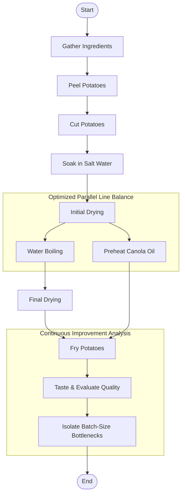

# Lean Six Sigma Process Improvement

## Overview
This project applies Lean Six Sigma principles to improve the efficiency and consistency of a homemade crispy potato cooking process. Across 12 structured trials and a final experimental 13th run, step durations were recorded and workflow adjustments were evaluated. Although frying time initially appeared to be the primary bottleneck due to its duration, deeper data analysis disproved this assumption. The final goal was to optimize line balance and minimize operator idle time while maintaining product quality. [Crispy Potato Process Improvement Study](https://drive.google.com/drive/folders/11wcdyJ_9n11BDbFKttX3Tapga-7NwzLa)

## DMAIC
### Define
The original cooking process was inconsistent. Numerous problems included excessive frying time, larger batches requiring significantly more time, limited equipment capacity, and an inconsistent workflow between cooking sessions. Earlier attempts also produced potatoes that were often soggy, overly oily, and lacked consistent crispiness, demonstrating the need for a more standardized process.

### Measure
A time study was conducted across thirteen cooking experiments. Each trial recorded the duration of every major process step to establish a baseline, compare process variation, and identify where the greatest amount of time was being spent.

Steps:
- Peeling
- Cutting
- Soaking in Salt Water
- Drying
- Vinegar-Water Boiling
- Final Drying
- Frying

### Analyze

When comparing all thirteen cooking logs, there were numerous recurring problems.

While the frying stage took the longest time and initially appeared to be the primary bottleneck, data analysis disproved this assumption. Instead, the true system constraint was driven by batch size and thermal recovery limits. Having larger potato batches dropped the oil temperature, creating a cascading bottleneck. This was worsened by equipment limitations, specifically using smaller cooking pots, which hampered overall process efficiency.

Additional observations also showed that organizing preparation steps and maintaining a consistent workflow helped minimize unnecessary waiting between stages.

### Improve

Several process improvements were tested throughout the thirteen cooking experiments.

These improvements included:

- Limiting potato batches to improve frying efficiency.
- Preheating the cooking oil before frying.
- Using a larger cooking pot to prevent overcrowding.
- Standardizing drying procedures before frying.
- Experimenting with vinegar-water cooking times.
- Refining preparation workflow to reduce idle time between process steps.

Each experiment built upon observations from previous trials to gradually improve process consistency.

### Control

The final process recommendations help maintain consistent product quality while reducing unnecessary cooking time.

Recommended standard practices include:

- Optimize batch sizes by limiting each batch to two or three potatoes.
- Always preheat the oil before frying to ensure thermal recovery.
- Use a sufficiently large cooking pot to prevent any capacity constraints.
- Maintain consistent drying times before frying.
- Follow the standardized cooking workflow developed throughout the study.

These recommendations reduce process variation while improving consistency and minimizing wasted energy.

## Key Results

- 13 documented cooking trials: Conducted a 12-trial time study alongside a final, experimental 13th run.
- Complete time study: Documented and evaluated every major process step to map baseline variations.
- Isolated true constraints: Disproved frying time as the primary bottleneck, identifying batch size and thermal recovery as the true limits.
- Developed a standardized, parallel cooking workflow to minimize operator idle time.
- Recommended smaller batch sizes to optimize equipment capacity and reduce process variation.
- Applied DMAIC methodology: Executed Lean Six Sigma principles within a real-world environment.

### Process Data Summary

A total of thirteen cooking experiments were conducted to evaluate how process changes affected preparation time, cooking efficiency, and overall workflow. Each experiment recorded the duration of every major process step, allowing bottlenecks and process improvements to be identified over time.

#### Overall Time Study

| Log | Potatoes | Frying Time | Total Time | Key Observation |
|------|---------:|------------:|-----------:|-----------------|
| #1 | 2 | 20:00 | 42:29 | Baseline process established |
| #2 | 3 | 33:33 | 1:00:50 | Oil not fully preheated |
| #3 | 4 | 48:00 | 1:31:50 | Equipment limitations appeared |
| #4 | 4 | 45:00 | 1:17:29 | Lemon-water experiment |
| #5 | 4 | 22:00 | 50:19 | Most efficient overall process |
| #6 | 5 | 1:28:00 | 2:20:14 | Largest bottleneck observed |
| #7 | 4 | 57:34 | 1:33:51 | Preparation improved, frying remained bottleneck |
| #8 | 4 | 40:07 | 1:18:03 | Fastest preparation stages |
| #9 | 7 | 43:20 | 1:25:41 | Old knife proved more efficient |
| #10 | 5 | 1:19:34 | 2:25:24 | Parallel workflow introduced |
| #11 | 4 | 55:00 | 1:38:34 | Process flaws, successful outcome |
| #12 | 6 | 1:09:10 | 1:59:57 | Smaller batches recommended |
| #13 | 1 | 17:20 | 41:00 | Experimental run; isolated batch size as key driver |

**Note:** In Log #10, the recorded total time includes overlapping vinegar-water boiling and post-boil drying activities. The actual elapsed ("wall-clock") time was somewhat shorter because these two tasks were performed in parallel.

#### Major Process Findings

| Observation | Finding |
|-------------|---------|
| Primary Bottleneck | Frying consistently consumed the largest portion of total process time. |
| Batch Size | Larger batches increased total cooking time disproportionately. |
| Equipment | Small pot size reduced boiling and frying efficiency. |
| Knife Selection | The original knife provided faster, more consistent cutting than the newer knife. |
| Workflow | Overlapping boiling and drying reduced idle time. |
| Standardized Process | Repeating the same workflow improved consistency across later experiments. |

Overall, the collected data demonstrated that improvements to preparation stages minimized manual work, while the final experimental run proved that system throughput was ultimately constrained by batch size rather than frying time alone. Future process improvements should prioritize heat management, expanded equipment capacity, and optimized batch sizing to further reduce total cycle time.

#### Bottleneck Analysis

Throughout the thirteen cooking experiments, several recurring bottlenecks were identified. While preparation times generally improved through practice and workflow refinement, the frying stage consistently limited the overall throughput of the process.

| Process Step | Observation | Improvement Opportunity |
|--------------|-------------|-------------------------|
| Frying | Longest stage in every experiment; heavily dependent on oil temperature recovery. | Improve oil temperature control, optimize batch size, or use larger equipment. |
| Vinegar-Water Boiling | Larger batches required multiple boiling cycles due to limited pot capacity. | Use a larger pot or reduce the number of potatoes per batch. |
| Cutting | Early experiments showed high variation due to knife choice and technique. | Standardize cutting method and continue using the original knife. |
| Drying | Longer drying improved crispiness but increased preparation time. | Determine the minimum effective drying time. |
| Workflow Organization | Early logs contained idle time between stages. Later experiments introduced overlapping tasks to balance the line. | Continue using parallel preparation to minimize operator idle time. |

### MOST Analysis

The crispy potato process was evaluated from a work measurement perspective using MOST (Maynard Operation Sequence Technique).

Although a complete MOST time standard was not developed for this project, several manual tasks were identified as candidates for future analysis, including:

- Peeling potatoes
- Cutting potatoes into uniform strips
- Moving potatoes between soaking, drying, and boiling stages
- Loading and unloading potatoes from the frying pot
- Organizing tools and workspace during preparation

A future MOST analysis could establish standard times for each manual operation, identify unnecessary motions, and further optimize line balance to minimize operator idle time through improved work methods.

## Process Maps

The cooking process was organized into three major phases: **Preparation**, **Cooking**, and **Continuous Improvement**. Separating the workflow into phases made the process easier to analyze and helped identify where delays occurred.

## Data Analysis

This section presents quantitative analyses performed using data collected throughout the crispy potato process improvement study. Rather than relying solely on observations from individual process logs, these analyses summarize process performance using structured Industrial Engineering techniques. Following the original twelve production trials, an additional experimental run (Log #13) was conducted to evaluate batch-size optimization, test parallel line balancing, and isolate system constraints using an enhanced data collection worksheet.

### Validation Study (Batch #13)

Unlike the previous twelve production logs, which focused on documenting baseline process variations, Batch #13 served as a final experimental run. The purpose of this batch was to demonstrate standardized data collection, evaluate batch-size optimization, and apply Lean Six Sigma analysis tools to isolate final system constraints.

The improved worksheet captured detailed process information including:

- Batch Number
- Date
- Material Classification
- Input Quality Rating
- Potato Quantity
- Process Step
- Step Start Time
- Step End Time
- Stopwatch Duration
- Stopwatch Duration (Seconds)
- Input Mass
- Scrap Mass
- Yield Percentage

### Batch #13 Summary

| Metric | Value |
|---------|------:|
| Batch Number | 13 |
| Material | Golden Potatoes |
| Potato Quantity | 1 |
| Input Quality | 3/5 |
| Input Mass | 235 g |
| Scrap Mass | 28 g |
| Yield | 88.09% |
| Total Cycle Time | 2053 sec |

Note: The Total Cycle Time of 2,053 seconds (34:13) reflects the active processing time. The total elapsed wall-clock time was 41:00, accounting for brief handling delays between process steps.

### Process Time Breakdown

| Process Step | Time (sec) |
|--------------|-----------:|
| Frying | 1040 |
| Final Drying | 330 |
| Water Boiling | 300 |
| Cutting | 158 |
| Initial Drying | 120 |
| Soaking | 60 |
| Peeling | 45 |

### Batch #13 Pareto Chart

### Pareto Analysis

The Batch #13 experimental run used Pareto analysis to quantify how total process time was distributed across the optimized workflow. The results perfectly demonstrate the Pareto Principle (80/20 Rule). Frying accounted for 1,040 seconds (50.66%) of the total process time. Combined with Final Drying and Water Boiling, these three operations represented 81.34% of the total active cycle time. In contrast, the manual preparation steps contributed less than 20%, proving that optimizing minor preparation tasks alone would have a limited impact on system capacity.

### Experimental Run Analysis (Batch #13)

Batch #13 served as a single-potato experimental run designed to isolate process variation. Rather than repeating previous trials, this experiment verified that the standardized parallel workflow could be measured consistently using an enhanced Industrial Engineering data collection format. Compared with earlier production batches, preparation stages required substantially less time, supporting the conclusion that much of the observed variation in previous experiments was heavily driven by batch size and thermal recovery limits.

### Waiting Time Analysis

Comparing active process time with the overall production timeline identified an additional improvement opportunity.

* Total active stopwatch time: 2,053 seconds
* Elapsed wall-clock time: 2,460 seconds
* Non-value-added waiting time: 407 seconds

These transition periods represent opportunities to further minimize operator idle time through tighter workflow organization and standardized task sequencing.

### Process Constraint Evaluation

Although Frying represented the largest portion of total process time, the longest activity is not necessarily the system bottleneck. From an Industrial Engineering perspective, a true bottleneck is the process that limits overall throughput.

Because Batch #13 was conducted as a single-potato run, it successfully isolated the baseline processing capacity. By comparing this data against the massive delays seen in larger trials (like Log #6), it proved that the ultimate system bottleneck was not the frying time itself, but rather batch size and oil thermal recovery limits. This insight provides a reliable baseline for future workstation balancing, takt time calculations, and larger production batches.
