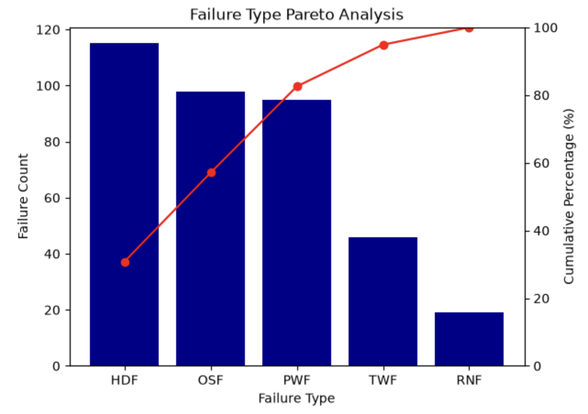
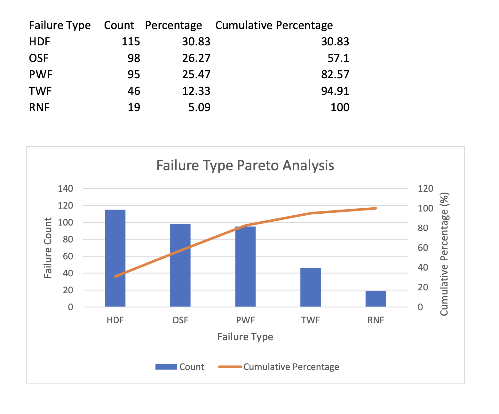

# Predictive Maintenance & Machine Failure Analysis

### 👤 Author
* **Ryan D. Vo** – Cal Poly Pomona Industrial Engineering
* **Project Timeline:** August 2026
* **Project Focus:** Predictive Maintenance, Machine Reliability, and Failure Analysis
* **Tools:** PostgreSQL, Python, Pandas, Matplotlib
* **Dataset Source:** [Kaggle AI4I 2020 Predictive Maintenance Dataset](https://www.kaggle.com/datasets/stephanmatzka/predictive-maintenance-dataset-ai4i-2020/data)

<br>

---

<br>

## 1. Define & Measure (DMAIC Framework)

In manufacturing environments, unexpected machine failures can lead to production downtime, reduced efficiency, and increased maintenance costs. This project analyzes machine operating conditions and failure data using SQL and Python to identify common failure types, compare failure patterns, and explore factors that may be associated with equipment failure.

### Project Objectives & Scope:

* **Analyzed 10,000 machine records using PostgreSQL and Python/Pandas to examine equipment performance and failure patterns.**
* **Compared five machine failure types—TWF (Tool Wear Failure), HDF (Heat Dissipation Failure), PWF (Power Failure), OSF (Overstrain Failure), and RNF (Random Failure)—to determine which failure modes occurred most frequently.**
* **Created a Pareto analysis in Python/Matplotlib to identify the failure types contributing the largest share of recorded failure occurrences.**
* **Explored operating variables such as tool wear, torque, rotational speed, and temperature to investigate their relationship with machine failures.**

## 2. Data Import & PostgreSQL Setup

The AI4I 2020 Predictive Maintenance dataset was downloaded from Kaggle as a CSV file and imported into a PostgreSQL database using pgAdmin 4. A dedicated table, predictive_maintenance, was created to organize the 14 dataset variables and prepare the data for SQL and Python analysis.

### PostgreSQL Table Creation

The following SQL statement was used to create the table and assign appropriate data types to each variable:

```sql
CREATE TABLE predictive_maintenance (
    uid INTEGER PRIMARY KEY,
    product_id VARCHAR(20),
    type CHAR(1),
    air_temperature_k NUMERIC,
    process_temperature_k NUMERIC,
    rotational_speed_rpm INTEGER,
    torque_nm NUMERIC,
    tool_wear_min INTEGER,
    machine_failure INTEGER,
    twf INTEGER,
    hdf INTEGER,
    pwf INTEGER,
    osf INTEGER,
    rnf INTEGER
);
```

### CSV Import

The ai4i2020.csv dataset was imported into the predictive_maintenance table through pgAdmin 4 using the following import settings:

* **Format: CSV**
* **Encoding: UTF-8**
* **Header: Enabled**
* **Delimiter: Comma**
* **Total Records: 10,000**
* **Total Variables: 14**

### Data Verification

After importing the dataset, SQL was used to verify that the records were successfully stored in PostgreSQL:

```sql
SELECT COUNT(*)
FROM predictive_maintenance;
```

Result: 10,000 records

A sample of the imported data can also be inspected using:

```sql
SELECT *
FROM predictive_maintenance
LIMIT 10;
```

This database setup provides a structured foundation for analyzing machine failure frequencies, operating conditions, and equipment reliability patterns in later sections.

## 3. Pareto Principle Modeling (Python & Excel Analysis)
A Pareto analysis was performed using both Python and Microsoft Excel to identify the machine failure types contributing the largest share of recorded failure occurrences. The analysis compared five failure modes: TWF (Tool Wear Failure), HDF (Heat Dissipation Failure), PWF (Power Failure), OSF (Overstrain Failure), and RNF (Random Failure).

### Python Analysis

In Jupyter Notebook, **Pandas** was used to calculate the frequency and percentage of each failure type. The failure modes were ranked from highest to lowest frequency, and cumulative percentages were calculated from the original failure counts. **Matplotlib** was then used to create a Pareto chart combining failure-count bars with a cumulative-percentage line.

```python
# PARETO ANALYSIS

# Calculate the percentage of total failure occurrences
failure_counts["percentage"] = (
    failure_counts["count"] / failure_counts["count"].sum()
    * 100
).round(2)

# Calculate cumulative percentage directly from the original counts
failure_counts["cumulative_percentage"] = (
    failure_counts["count"].cumsum()
    / failure_counts["count"].sum()
    * 100
).round(2)

# Show the updated table
failure_counts
```

```python
# PARETO CHART

# Import Matplotlib
import matplotlib.pyplot as plt

# Sort failure types from highest count to lowest count
failure_counts_sorted = failure_counts.sort_values(
    "count",
    ascending=False
)

# Create the main figure and first axis
fig, ax1 = plt.subplots()

# Create the bar chart for failure counts
ax1.bar(
    failure_counts_sorted["failure_type"],
    failure_counts_sorted["count"],
    color="darkblue"
)

# Label the first set of axes
ax1.set_xlabel("Failure Type")
ax1.set_ylabel("Failure Count")

# Create a second y-axis for cumulative percentage
ax2 = ax1.twinx()

# Create the cumulative percentage line
ax2.plot(
    failure_counts_sorted["failure_type"],
    failure_counts_sorted["cumulative_percentage"],
    color="red",
    marker="o"
)

# Set the percentage axis from 0% to 100%
ax2.set_ylim(0, 100)

# Label the second y-axis
ax2.set_ylabel("Cumulative Percentage (%)")

# Add the chart title
plt.title("Failure Type Pareto Analysis")

# Display the chart
plt.show()
```

### Excel Analysis

The Pareto analysis was recreated in Microsoft Excel using a separate Pareto_Analysis worksheet. The original dataset remained unchanged in the Raw_Data worksheet, while Excel formulas were used to calculate failure counts, percentages, and cumulative percentages.

#### Failure Count

Because each failure column in the original dataset is binary (1 = failure occurred, 0 = failure did not occur), the SUM function was used to calculate the number of occurrences for each failure type.

HDF: =SUM(Raw_Data!K:K)

OSF: =SUM(Raw_Data!M:M)

PWF: =SUM(Raw_Data!L:L)

TWF: =SUM(Raw_Data!J:J)

RNF: =SUM(Raw_Data!N:N)

This produced the following failure counts:

| Failure Type | Count|
|---|---:|
| HDF | 115 |
| OSF | 98 |
| PWF | 95 |
| TWF | 46 |
| RNF | 19 |

#### Failure Percentage

Each failure count was divided by the total number of recorded failure-type occurrences. The result was multiplied by 100 and rounded to two decimal places.
The following formula was entered in cell C2:

=ROUND(B2/SUM($B$2:$B$6)*100,2)

The formula was then filled down through C6.
The $ symbols create an absolute reference, keeping the total range B2:B6 fixed while the individual failure-count reference changes for each row.

#### Cumulative Percentage

Cumulative percentages were calculated directly from the original failure counts rather than by adding the already-rounded percentages. This prevents rounding errors and ensures that the final cumulative percentage reaches exactly 100%.
The following formula was entered in cell D2:

=ROUND(SUM($B$2:B2)/SUM($B$2:$B$6)*100,2)

The formula was then filled down through D6.

**Calculation Note**: An initial cumulative calculation totaled 99.99% due to rounding individual percentages to two decimal places. To avoid this rounding discrepancy, cumulative percentages were recalculated directly from the original failure counts, resulting in a final cumulative value of 100.00%.

#### Excel Pareto Chart

A Combo Chart was created from the completed analysis table:

* Failure Count was displayed as a clustered column series.
* Cumulative Percentage was displayed as a line series.
* The cumulative-percentage line was assigned to a secondary vertical axis ranging from 0% to 100%.
* Failure types were arranged from highest to lowest occurrence: HDF, OSF, PWF, TWF, and RNF.

The resulting Excel Pareto chart reproduced the same failure distribution identified through the Python analysis.

## 4. Pareto Results & Visualization

The Pareto analysis was visualized independently in both **Jupyter Notebook** and **Microsoft Excel**. Although both charts use the same underlying failure data, creating the analysis in two different environments helped verify that the calculations and overall findings were consistent.

### Jupyter Notebook Pareto Chart

The Python visualization was created using Matplotlib, with failure counts represented by bars and cumulative percentage represented by a secondary line.

**Pareto Chart Below:**


### Microsoft Excel Pareto Chart

The Excel visualization was created as a Combo Chart using the calculated failure counts and cumulative percentages from the Pareto_Analysis worksheet.

**Excel Sheet & Pareto Chart Below:**


### Results Comparison

Both visualizations produced the same ranking of machine failure types:

This produced:
| Failure Type | Count | Percentage | Cumulative Percentage |
|---|---:|---:|---:|
| HDF | 115 | 30.83% | 30.83% |
| OSF | 98 | 26.27% | 57.10% |
| PWF | 95 | 25.47% | 82.57% |
| TWF | 46 | 12.33% | 94.91% |
| RNF | 19 | 5.09% | 100.00% |

The cumulative percentage crossed the 80% threshold after PWF, meaning that HDF, OSF, and PWF collectively accounted for approximately 82.57% of recorded failure-type occurrences.

The agreement between the Python and Excel results provides a cross-check of the analysis while demonstrating the ability to perform the same Pareto methodology using both programming-based and spreadsheet-based tools.
